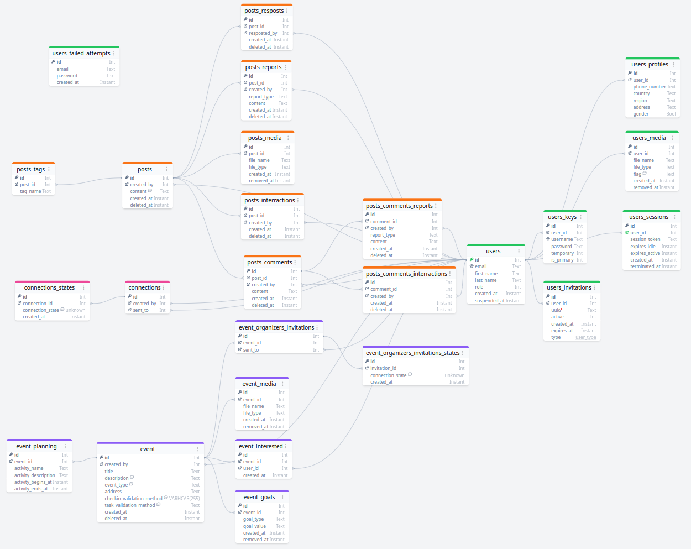

# PostgreSQL
[postgres_tables.aml](./postgres_tables.aml)
## AML screenshot
Screenshot of postgres database diagram. `(temporary)`  

## Part I - Users
- Media flags:

| D2 | D1 | D0 | Flag Name                | Flag            |
|----|----|----|--------------------------|-----------------|
| 0  | 0  | 0  | No Tag                   | NONE            |
| 0  | 0  | 1  | Profile Picture          | PROFILE         |
| 0  | 1  | 0  | Cover Picture            | COVER           |
| 0  | 1  | 1  | N/A                      | N/A             |
| 1  | 0  | 0  | N/A                      | N/A             |
| 1  | 0  | 1  | Profile Picture (Current)| PROFILE_CURRENT |
| 1  | 1  | 0  | Cover Picture (Current)  | COVER_CURRENT   |
| 1  | 1  | 1  | Deleted                  | REMOVED         |

# MongoDB
- Messages
- Notifications
