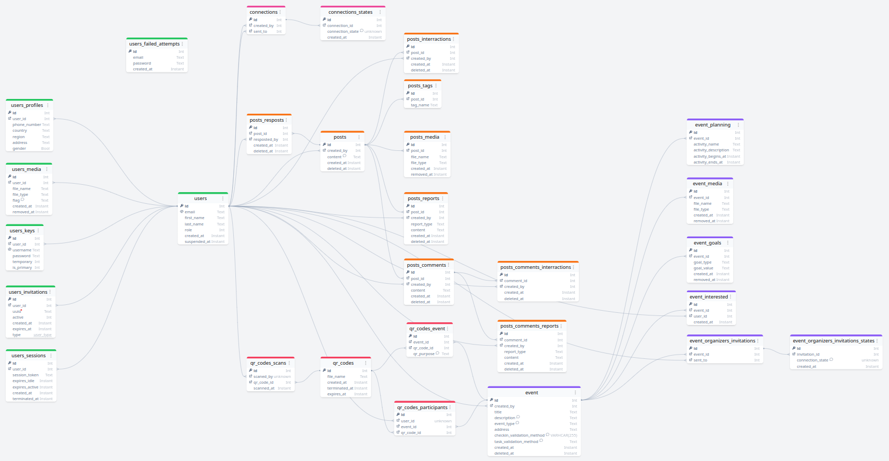

# PostgreSQL
[postgres_tables.aml](./postgres_tables.aml)
## AML screenshot
Screenshot of postgres database diagram. `(temporary)`  

## Queries
A list of queries used (generic) and their implementations

| User Event | Query |
| - | - |
| Sign-up | <pre>INSERT INTO users(email) VALUES($1);</pre>
||<pre>INSERT INTO users_authentication_credentials(   user_id,   username,   password,   is_primary ) VALUES(   (SELECT id FROM users WHERE email = $1),   CONCAT('EMAIL ', $2),   $3,    true );</pre> |
| Setup Profile - Full | <pre>INSERT INTO users_profiles (   user_id,   phone_number,   country,   region,   address,   gender )  VALUES (   (SELECT user_id AS id FROM users_sessions WHERE session_id = $1),   $2, $3, $4, $5, $6 );</pre> |
| Setup Profile - Partial | <pre>INSERT INTO users_profiles (   user_id,   {{column_name}} )  VALUES (   (SELECT user_id AS id FROM users_sessions WHERE session_id = $1),   $2 );</pre> |
| Update Profile - Full | <pre>UPDATE users_profiles SET (   phone_number,   country,   region,   address,   gender ) = (   $1, $2, $3, $4, $5 ) WHERE user_id = (   SELECT user_id AS id FROM users_sessions WHERE session_id = $6 );</pre> |
| Update Profile - Partial | <pre>UPDATE users_profiles  SET {{ column_name }} = $1 WHERE user_id = (   SELECT user_id AS id FROM users_sessions WHERE session_id = $2 );</pre> |
| Upload Media | <pre>INSERT INTO users_media (   user_id,   file_name,   file_type,   flag ) VALUES (   (SELECT user_id AS id FROM users_sessions WHERE session_id = $1),   $2, $3, $4 );</pre> |
| Delete Media | <pre>UPDATE users_media  SET flag = 'REMOVED' WHERE file_name = $1 AND user_id = (SELECT user_id AS id FROM users_sessions WHERE session_id = $2);</pre> |
| Update Cover or Profile Picture | <pre>UPDATE users_media  SET flag = $1 WHERE file_name != $2 AND user_id = (SELECT user_id AS id FROM users_sessions WHERE session_id = $3);</pre> |
## Part I - Users
- Media flags:

| D2 | D1 | D0 | Flag Name                | Flag            |
|----|----|----|--------------------------|-----------------|
| 0  | 0  | 0  | No Tag                   | NONE            |
| 0  | 0  | 1  | Profile Picture          | PROFILE         |
| 0  | 1  | 0  | Cover Picture            | COVER           |
| 0  | 1  | 1  | N/A                      | N/A             |
| 1  | 0  | 0  | N/A                      | N/A             |
| 1  | 0  | 1  | Profile Picture (Current)| PROFILE_CURRENT |
| 1  | 1  | 0  | Cover Picture (Current)  | COVER_CURRENT   |
| 1  | 1  | 1  | Deleted                  | REMOVED         |

# MongoDB
- Messages
- Notifications
